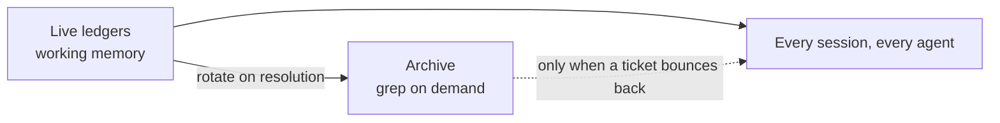

## A Pipeline That Already Worked

For months, a client's B2B trading platform has been maintained by an AI-driven pipeline with three phases:

- **Review.** Every open stakeholder ticket gets a root-cause write-up with numbered questions. Stakeholders answer inline.
- **Triage.** Answered questions become locked decisions. Tickets are prioritized, grouped to avoid file collisions, and pre-registered.
- **Execute.** One agent per group in parallel git worktrees, a serialized merge queue, and post-deploy verification on a live tier.

Dozens of tickets ship per week through zero-finding review gates, with stakeholders validating on a QA tier. The pipeline worked. Working systems still deserve audits, and this one was overdue.

## Finding the Real Cost Center

The audit question was simple: where does every session spend tokens before doing anything useful?

The answer was the coordination layer.

| File | Purpose | Size |
|------|---------|------|
| Session ledger | Who's working on what, merge lock, migration claims | 116 KB |
| Shipped-pending log | Fixes awaiting stakeholder validation | 69 KB |
| Deferred registry | Landmines and blocked work | 64 KB |

Every session read these at boot. Every spawned agent read them again.

The session ledger's "current state" section was actually a reverse-chronological journal of every sprint since the pipeline began. The shipped log's own lifecycle said rows should be removed after validation. Instead they accumulated as history.

Nobody decided to build an archive. It grew one append at a time, because appending is always the path of least resistance. That is coordination debt: state files that quietly become history files, taxing every reader forever.

## Live State Is Working Memory, Not an Archive

The fix borrows directly from how memory should work in any agent system:



- Live files hold live rows only. Finished sessions, validated fixes, and superseded state rotate out at run close.
- History stays fully recoverable. It is archived verbatim and searched only when a bounced ticket needs its prior-fix context.
- The rotation rule lives in each file's header, so every future session enforces it without being told.

Result: 116 KB down to 5 KB. 69 KB down to 9 KB. Multiplied by every session and every agent, every day.

## Derive, Don't Store

The audit also found a bug factory: machine-critical state embedded in prose.

The ledger stored "next available migration number: 100." By execute time, 100 and 101 had already merged from other sessions. The number was stale, and only a defensive re-check caught it before a collision with a write-once migration system.

The rule that replaced it: store claims, derive facts.

A claim ("session X owns migration 103") is coordination. It belongs in the ledger. A fact ("the next free number") has a source of truth in the repo and should be derived at the moment it's needed, never cached in a document that cannot know it has gone stale.

A small machine-readable state file now mirrors the human ledger: tier SHAs, merge lock, open claims. Both are updated in the same edit. The prose is for humans. The YAML is for agents.

## Contracts Beat Prose Rules

One more finding: about a quarter of agent completion reports claimed "merge-ready" while still listing unresolved review findings.

The rule against this existed, in prose. Prose rules get re-litigated.

Now every build agent must end with a structured completion block:

```json
{
  "tsc": "0 errors",
  "unit": "pass",
  "guards": ["trade-flow: pass"],
  "findings_outstanding": 0,
  "blocked": null
}
```

A report with `findings_outstanding > 0` gets bounced. Mechanically, with no discussion. The orchestrator stopped being a negotiator and became a gate.

## Then the Pipeline Tested Itself

Hours after the optimization shipped, something unplanned happened. Two triage runs (one booted by the operator, one delegated to a background agent) raced into the same session directory, minutes apart, neither aware of the other.

Two fully independent analyses of the same 35 open tickets.

They agreed on everything material:

- Same open count, same status histogram
- Same deploy-state snapshot
- Same carve-outs, down to the individual tickets awaiting stakeholder answers
- Same core grouping of the actionable work

Different group names. Identical conclusions.

When two independent runs converge on 35 of 35 tickets, the outcomes are not riding on model temperature or session luck. The protocol is carrying the work. That is the property you want before handing a pipeline more autonomy, and you usually only get to observe it by accident.

## Every Collision Is a Missing Lock

The collision still exposed a gap.

The merge queue had a lock. The migration numbers had claims. The triage directory had neither. Nothing said "this run is taken."

The fix took one paragraph in the protocol: the first action of any triage run is now writing a claim file into the session directory. A claimed directory means boot a second round or ask the operator.

One duplicated hour of compute bought a permanent coordination guarantee, and the duplicate run doubled as the validation study.

## The Numbers

| Metric | Before | After |
|--------|--------|-------|
| Session ledger | 116 KB | 5 KB |
| Shipped-pending log | 69 KB | 9 KB |
| False "merge-ready" claims | ~25% of reports | Bounced by schema |
| Stale-derived state incidents | 2 | 0 (derived live) |
| Independent triage agreement | untested | 35/35 tickets |

## Takeaways

- Coordination files are working memory. If every agent reads a file at boot, history does not belong in it.
- Store claims, derive facts. Anything with a source of truth goes stale the moment you write it down somewhere else.
- Put contracts in the completion format, not the instructions. Schemas get enforced; prose gets re-litigated.
- Two independent runs agreeing on the same inputs is a better trust signal than any benchmark.
- Every collision is a missing lock. Fix the protocol, not the participants.

The bottleneck in this pipeline was never the models. It was the filing system.
