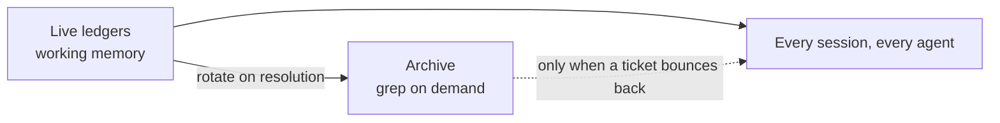

## A Pipeline That Already Worked

For months, a client's B2B trading platform has been maintained by an AI-driven pipeline:

- **Review** — every open stakeholder ticket gets a root-cause write-up with numbered questions the stakeholders answer inline.
- **Triage** — answered questions become locked decisions; tickets are prioritized, grouped to avoid file collisions, and pre-registered.
- **Execute** — one agent per group, parallel worktrees, a serialized merge queue, and post-deploy verification on a live tier.

Dozens of tickets shipped per week. Zero-finding review gates. Stakeholders validating on a QA tier.

It worked. Which is exactly when you should audit it.

---

## Finding the Real Cost Center

The audit question was simple: where does every session spend tokens before doing anything useful?

The answer was the coordination layer.

| File | Purpose | Size |
|------|---------|------|
| Session ledger | Who's working on what, merge lock, migration claims | **116 KB** |
| Shipped-pending log | Fixes awaiting stakeholder validation | **69 KB** |
| Deferred registry | Landmines and blocked work | **64 KB** |

Every session read these at boot.
Every spawned agent read them again.

The session ledger's "current state" section was actually a reverse-chronological journal of every sprint since the pipeline began. The shipped log's own lifecycle said rows should be removed after validation — instead they accumulated as history.

Nobody decided to build an archive.
It grew one append at a time, because appending is always the path of least resistance.

That's coordination debt: state files that quietly become history files, taxing every reader forever.

---

## Live State Is Working Memory, Not an Archive

The fix borrows directly from how memory should work in any agent system:



- **Live files hold live rows only.** Finished sessions, validated fixes, superseded seeds — rotated out at run close.
- **History stays fully recoverable** — archived verbatim, grep-able when a bounced ticket needs its prior-fix context.
- **The rotation rule lives in each file's header**, so every future session enforces it.

Result: 116 KB → **5 KB**. 69 KB → **9 KB**.
Multiplied by every session and every agent, every day.

---

## Derive, Don't Store

The audit also found a bug factory: machine-critical state embedded in prose.

The ledger stored "next available migration number: 100."
By execute time, 100 and 101 had already merged from other sessions. The number was stale, and only a defensive re-check caught it before a collision with a write-once migration system.

The rule that replaced it:

> Store **claims**. Derive **facts**.

A claim ("session X owns migration 103") is coordination — it belongs in the ledger.
A fact ("the next free number") has a source of truth — the repo — and should be derived at the moment it's needed, never cached in a document that can't know it's stale.

A small machine-readable state file now mirrors the human ledger: tier SHAs, merge lock, open claims. Both updated in the same edit. The prose is for humans; the YAML is for agents.

---

## Contracts, Not Vibes

One more finding: about a quarter of agent completion reports claimed "merge-ready" while still listing unresolved review findings.

The rule against this existed — in prose. Prose rules get re-litigated.

Now every build agent must end with a structured completion block:

```json
{
  "tsc": "0 errors",
  "unit": "pass",
  "guards": ["trade-flow: pass"],
  "findings_outstanding": 0,
  "blocked": null
}
```

`findings_outstanding > 0` → bounced. Mechanically. No discussion.

The orchestrator stopped being a negotiator and became a gate.

---

## Then the Pipeline Tested Itself

Hours after the optimization shipped, something unplanned happened: two triage runs — one booted by the operator, one delegated to a background agent — raced into the same session directory, minutes apart, neither aware of the other.

Two fully independent analyses of the same 35 open tickets.

They agreed on everything material:

- Same open count, same status histogram
- Same deploy-state snapshot
- Same carve-outs — down to the individual tickets awaiting stakeholder answers
- Same core grouping of the actionable work

Different group names. Identical conclusions.

When two independent runs converge like that, your outcomes aren't riding on model temperature or session luck. **The protocol is doing the work.** That's the property you want before you hand a pipeline more autonomy — and you usually only get to observe it by accident.

---

## Every Collision Is a Missing Lock

The collision itself still exposed a gap.

The merge queue had a lock. The migration numbers had claims.
The triage directory had neither — nothing said *"this run is taken."*

The fix took one paragraph in the protocol: the first action of any triage run is now writing a claim file into the session directory. A claimed directory means boot a second round or ask the operator.

One duplicated hour of compute bought a permanent coordination guarantee — and the duplicate run doubled as the validation study.

---

## The Numbers

| Metric | Before | After |
|--------|--------|-------|
| Session ledger | 116 KB | 5 KB |
| Shipped-pending log | 69 KB | 9 KB |
| Merge-ready false claims | ~25% of reports | Bounced by schema |
| Stale-derived state incidents | 2 | 0 (derived live) |
| Independent triage agreement | — | 35/35 tickets |

---

## Takeaways

- **Coordination files are working memory.** If every agent reads it at boot, history doesn't belong in it.
- **Store claims, derive facts.** Anything with a source of truth goes stale the moment you write it down elsewhere.
- **Prose rules get re-litigated; schemas get enforced.** Put the contract in the completion format, not the instructions.
- **Determinism is the trust metric.** Two independent runs agreeing is worth more than any benchmark.
- **Every collision is a missing lock.** Fix the protocol, not the participants.

The models were never the bottleneck.
The filing system was.
