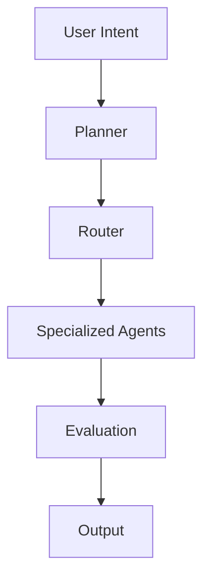

## The Wrong Question

Almost every serious AI conversation starts the same way:

> Which model should I use?

It sounds informed. It sounds practical.
It's also the wrong question.

Modern frontier models are already *overqualified* for what most people are building. When AI systems feel slow, expensive, brittle, or inconsistent, the limiting factor is almost never raw intelligence.

It's architecture.

If intelligence were the constraint, the problem would already be solved by whoever trained the largest model. Instead, we see teams burning tokens, smashing context windows, and upgrading models to compensate for systems that don't know how to think efficiently.

That instability isn't accidental. It's structural.

---

## Intelligence vs Capability

A critical distinction that most teams never make:

| Concept | What It Represents | Why It Matters |
|------|-------------------|---------------|
| Intelligence | Raw reasoning ability | Easy to rent, expensive to abuse |
| Capability | Reliable, repeatable outcomes | Only emerges from structure |
| Performance | Output quality in isolation | Often misleading |
| System Health | Stability over time | Determines long-term viability |

A model can be extremely intelligent and still be operationally useless.

Capability only appears when intelligence is:
- Allocated intentionally
- Activated selectively
- Constrained by policy
- Reinforced by memory

Without those constraints, intelligence behaves like an unbounded resource.
And unbounded resources don't scale. They leak.

---

## Why Bigger Models Feel Like Progress

Larger models temporarily hide architectural debt.

They tolerate:
- Overloaded prompts
- Poor sequencing
- Missing planning layers
- Redundant reasoning
- Sloppy context management

This tolerance creates the illusion that the system is improving.

It isn't.

The moment complexity increases, these systems collapse under their own weight. The usual response is predictable:
- Add more context
- Increase temperature tuning
- Upgrade the model tier

Each move increases cost while leaving the core problem untouched.

---

## From Prompting to Systems Thinking

Prompting optimizes *questions*.
Systems thinking optimizes *where thinking should happen at all*.

The shift looks like this:

| Prompt-Centric Thinking | System-Centric Thinking |
|------------------------|------------------------|
| One giant prompt | Scoped, layered goals |
| Continuous context | Bounded memory |
| One model | Specialized agents |
| Hope-based execution | Policy-based routing |
| Reactive behavior | Planned cognition |

This isn't about overengineering.

It's about **containing intelligence so it can compound instead of explode**.

---

## A Minimal Thinking Stack

The smallest abstraction that consistently scales looks like this:

Each layer exists to answer a different question:
- **Planner:** What should happen?
- **Router:** Who should think?
- **Agents:** How is thinking specialized?
- **Evaluation:** Is the result acceptable?

When these concerns are collapsed into a single model call, the system defaults to thinking everywhere, all the time. That's the most expensive failure mode possible.

---

## Cost Is a Symptom, Not the Disease

When people complain about:
- Rate limits
- Usage caps
- Token pricing
- Model availability

They're observing symptoms.

The disease is uncontrolled cognition.

A system that:
- Thinks when it shouldn't
- Re-thinks what it already knows
- Thinks with the wrong level of intelligence
- Has no memory of prior decisions

Will always feel expensive, regardless of which model you choose.

---

## The Mental Shift That Actually Matters

The most important questions in AI architecture aren't about models:

- What deserves deep reasoning?
- What can be cached?
- What should be remembered permanently?
- What should never be recomputed?
- What should not be thought about at all?

These aren't prompting questions.

They're **systems design questions**.

---

If your AI workflows feel:
- Expensive
- Fragile
- Inconsistent

Upgrading the model is the most tempting move.

It's also the least effective.

Real leverage comes from upgrading the nervous system, not the brain.

---
