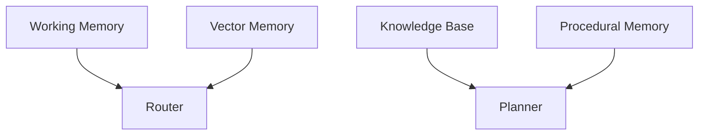

## Thinking Is Not Free

Every token is a decision.
Every decision has a cost.

Most AI systems behave as if thinking is infinite and free. It isn't.
Uncontrolled cognition is the fastest way to make a system expensive without making it meaningfully better.

When costs spike, teams blame pricing tiers, rate limits, or model choice.
Those are symptoms.
The root cause is almost always architectural.

---

## Intelligence Without Control Is a Liability

Intelligence answers **how well** a system can reason.
Orchestration answers **when, where, and whether** it should reason at all.

Without orchestration:
- Every agent thinks all the time
- Context grows without bounds
- The same reasoning repeats
- Costs scale faster than capability

With orchestration:
- Thinking is conditional
- Expensive reasoning is rare
- Cheap cognition does most of the work
- Costs become predictable

This is not an optimization detail.
It is the control plane.

---

## Cost Problems Are Design Problems

When people complain about:

- Token burn
- Usage caps
- Long runtimes
- Output variance

They're observing architectural failures.

| Symptom | Root Cause |
|------|-----------|
| Token spikes | No routing or gating |
| Repeated reasoning | No memory |
| Long chains | No stopping rules |
| Inconsistent output | No evaluation |
| Budget anxiety | No control plane |

You can't tune your way out of this.
You have to design your way out.

---

## Orchestration Decides Who Gets to Think

Orchestration answers questions models never will:

- Which agent should run right now?
- With how much context?
- At what confidence threshold do we stop?
- Who decides the output is acceptable?

Without explicit answers, systems default to thinking everywhere, all the time.
That's the most expensive configuration possible.

---

## Memory Is Cognitive Leverage

Memory prevents recomputation.

If a system repeatedly:
- Plans the same workflows
- Summarizes the same context
- Re-critiques known weaknesses

...it's paying multiple times for the same thought.

That isn't intelligence.
That's waste.

---

## Memory Layers That Actually Matter

| Memory Type | Stores | Prevents |
|------------|--------|----------|
| Working | Current state | Context overload |
| Vector | Similar past cases | Redundant reasoning |
| Knowledge | Canonical facts | Hallucinations |
| Procedural | System behavior | Re-learning mistakes |

Memory turns cognition from a linear cost into a compounding asset.

---

## Routing Determines Cost More Than Models

Routing decides **who thinks**.

A router that:
- Triggers too many agents
- Shares too much context
- Escalates too early

Will burn budget regardless of model choice.

Good routing:
- Defers expensive reasoning
- Activates specialists conditionally
- Stops execution when confidence is sufficient

This is cost engineering, not prompt engineering.

---

## When Not to Think

The most important architectural question is not:
"How can the system think better?"

It is:
"What thinking can we avoid entirely?"

Great systems:
- Cache aggressively
- Reuse decisions
- Escalate only on uncertainty
- Terminate early

They feel fast, cheap, and reliable because they are.

---

## The Payoff of Disciplined Cognition

When orchestration and memory are first-class systems:

- Cheap cognition handles cheap tasks
- Expensive reasoning is rare and justified
- Costs stabilize instead of spike
- Outputs converge instead of oscillate
- Trust compounds over time

This is how AI systems move from clever demos to real infrastructure.

---

Smart systems think well.
Great systems know **when not to think**.

That difference is orchestration.

---
