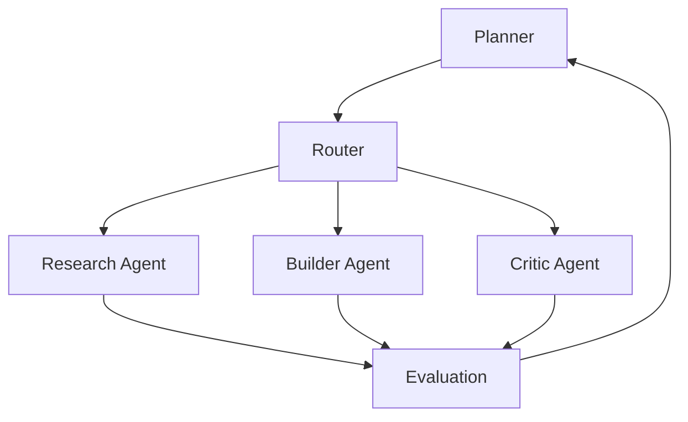

## The Dangerous Myth of Parallel Intelligence

Most people assume that more agents means more intelligence.

It doesn't.

In practice, it usually means:
- Higher costs
- Louder disagreement
- Slower convergence
- Less reliable output

Parallelism without structure is not intelligence.
It's entropy.

---

## What a Swarm Actually Is

A swarm is not "many models running at once."

A real swarm is a **structured organization**:
- Each agent has a narrow mandate
- Authority is explicitly hierarchical
- Execution is gated by state
- Outputs are judged, not trusted

Intelligence emerges from **coordination**, not concurrency.

---

## Why Most Swarms Fail (Predictably)

| Failure Pattern | Root Cause | What You See |
|---------------|-----------|--------------------|
| Flat agent authority | No decision hierarchy | Endless debate |
| Shared global context | No information hygiene | Token explosion |
| Always-on agents | No routing logic | Cost spikes |
| No stopping rules | No confidence thresholds | Infinite loops |
| No evaluator | No quality gate | Inconsistent outputs |

These aren't AI failures.
They're organizational failures.

---

## Minimum Viable Swarm (MVS)

A disciplined swarm starts smaller than people expect.

| Role | Purpose | Explicitly Forbidden |
|-----|--------|---------------------|
| Planner | Break goals into steps | Executing tasks |
| Router | Decide which agent runs | Reasoning deeply |
| Research Agent | Gather information | Deciding outcomes |
| Builder Agent | Execute instructions | Changing scope |
| Critic Agent | Identify weaknesses | Producing final output |
| Verifier Agent | Validate correctness | Creative generation |

Each agent is intentionally constrained.
Constraints are what make the system scalable.

---

## Authority Hierarchy Is Non-Negotiable

Swarms collapse without clear authority.

No agent self-activates.
No agent decides the final answer.
No agent bypasses evaluation.

This prevents oscillation, loops, and runaway execution.

---

## Gating Beats Parallelism Every Time

The instinct to run agents in parallel is understandable. And wrong.

Effective swarms:
- Activate agents conditionally
- Stop early when confidence is sufficient
- Escalate only when uncertainty remains

Parallel execution without gating is just faster failure.

---

## Swarms Behave Like Organizations

Designing swarms becomes easier when you stop thinking about AI.

Bad swarms look like bad companies:
- Everyone talks
- Nobody decides
- Meetings never end

Good swarms look like good organizations:
- Clear roles
- Clear authority
- Clear escalation paths
- Clear stopping rules

This is not metaphor.
It is architecture.

---

## The Real Payoff

When designed correctly:
- Cheap agents handle cheap cognition
- Expensive reasoning is reserved for hard decisions
- Quality stabilizes instead of oscillating
- Costs become predictable

This is how intelligence compounds instead of burning out.

---

Swarms don't scale because they're clever.

They scale because they're **disciplined**.

Without structure, more agents means more chaos.
With structure, even simple agents become powerful.

---
