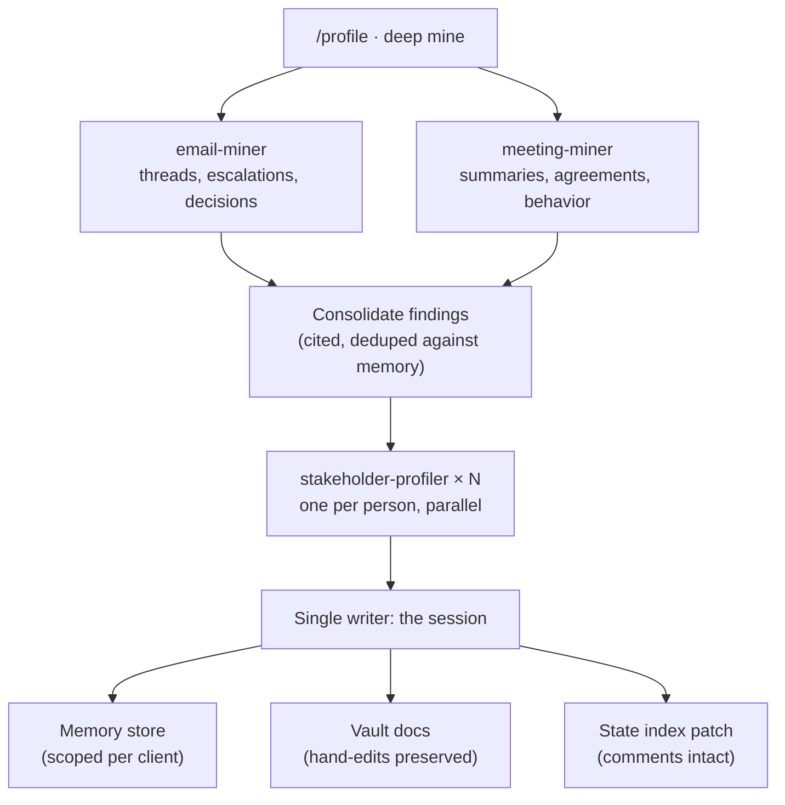

## The Gap

Tooling that grows around an AI assistant splits along a predictable fault line. Deterministic work (scraping, file writes, state tracking) hardens into scripts. Intelligence work (synthesis, judgment) stays in prompts. Left alone, the two halves drift into separate tools with separate interfaces, and the seams start costing real time.

This pipeline consolidates two tools that had drifted exactly that way. One was a 1,000-line Python CLI that scraped websites and PDFs, then paid a second LLM bill through its own API keys to fill a strategy template. The other had no code at all: a prompt spec and seven loose slash commands that mined email and meeting history into a memory store and human-readable briefing docs. Both wrote a file with the identical name into the same folder tree. The email tooling only connected when the assistant launched from one specific directory. And every rule that kept the state files intact (preserve the YAML comments, never overwrite a hand-edited block) lived in prompt text, where an instruction is a request, not a guarantee.

## What I Built

The consolidation follows one rule: **intelligence in the session, mechanics in code.**

A Claude Code plugin owns the operator surface: seven commands and three mining agents, versioned in git, installed live so an edit takes effect next session. A thin Python MCP server owns everything that must behave the same way every time:

| Tool | Job |
|------|-----|
| `scrape_url` | Clean-text page extraction, truncation-guarded so a huge page can't flood the context window |
| `extract_pdf` | PDF text with page markers, page and character limits |
| `list_clients` | Dashboard summary across every client's state index in one call |
| `read_index` | One client's full state, fuzzy name resolution |
| `update_index` | Deep-merge patch; YAML comments survive byte-for-byte; invoice aging recalculated, never hand-set |
| `write_market_profile` | Cleans model output, enforces frontmatter, writes the canonical filename |
| `write_engagement_doc` | Splices operator hand-edits back into regenerated docs, reports conflicts |

No LLM runs inside the server. It fetches and persists. Analysis happens in the session that called it, which deletes the separate API bill and means profile quality upgrades every time the session model does.

## One Front Door

`/profile "Client Name"` replaces the decision the operator used to make by hand: which of five commands does this situation need. It inventories what exists (folder, state index, market profile, memory coverage, minable history), classifies the engagement as greenfield, retrofit, partial, or mature, and recommends a path. New clients get a light build. Clients with months of accumulated history get the deep mine. Mature profiles get a delta refresh instead of a rebuild. Every write is previewed and gated.

The weekly loop runs on three of the commands: a read-only dashboard flags what is stale or aging (14-day refresh windows, 60-day invoices, open escalations), a refresh command re-mines only what changed since the last pass, and a brief command renders a one-page operating picture before a meeting.

## Orchestration Without an Orchestrator

The deep-mine path fans out to agents, but there is no orchestration agent. The session running the command is the orchestrator.

Two miners run in parallel: one over email history, one over meeting records. Their output is structured findings with citations (date, subject, quote), each marked new, update, or already-known against the existing memory store. A third agent synthesizes one stakeholder profile per significant person, fanned out concurrently.

The agents share one constraint that makes the whole thing reliable: **they never write.** Findings come back to the session, and the session is the only writer. Search-first deduplication is enforceable in exactly one place. Two agents storing memories concurrently would defeat it.

Cost tracks the work. A delta refresh runs inline for 5 to 15k tokens because agent overhead isn't worth it on a small window. A full deep mine fans out and runs 50 to 100k.

## Guarantees, Not Instructions

The state layer is a per-client YAML index: participants, domains, active projects, escalations, invoices, contract paths, memory IDs. Operators annotate these files by hand, so the comments carry real information. The old pipeline protected them with a sentence in a prompt. The new one protects them with code:

- **Comment-preserving round-trips.** Every index patch is a deep merge through a round-trip YAML parser. The smoke test asserts that load-then-dump reproduces the file byte-for-byte before any patch logic runs.
- **Hand-edit preservation as a merge algorithm.** Blocks marked in a doc survive regeneration through labeled matching. Orphaned blocks are appended, never dropped, and conflicts are reported instead of resolved silently.
- **Derived fields stay derived.** Invoice aging is recalculated from commitment dates on every patch. Nothing hand-sets a number the code can compute.

The cutover itself ran under the same discipline. The filename collision between the two old tools was resolved by a migration script with a dry-run default, vault-wide link rewriting, and ambiguity detection: references that could point at either file were reported for review instead of rewritten, and every rename was logged for rollback.

## Design Principles

**Thin server.** If a task needs judgment, it doesn't belong in the MCP. The server's seven tools fetch and persist; the session thinks.

**Single writer.** Any number of agents can mine. One session commits. Deduplication, contradiction handling, and audit responsibility live in one place.

**Guarantee in code what prompts can only request.** Comment preservation, hand-edit merging, and derived-field recalculation moved from prompt discipline into deterministic functions with tests.

**Degrade honestly.** If the email infrastructure is down, the command says so and offers a reduced scope. It never produces a thin profile and calls it complete.

## Results

- One command onboards any client; the pipeline classifies the situation instead of asking the operator to remember which tool applies
- Works from any directory: the email and meeting integrations moved from project-scoped to user-scoped registration, removing the launch-directory dependency
- State files round-trip byte-identical, verified by the smoke suite on every server change
- Dual output per client: queryable memories for the assistant, readable briefing docs for the human, kept in sync by the same write path
- Both components are git-versioned; the plugin is live-installed, so iteration is an edit and a session restart, not a reinstall
