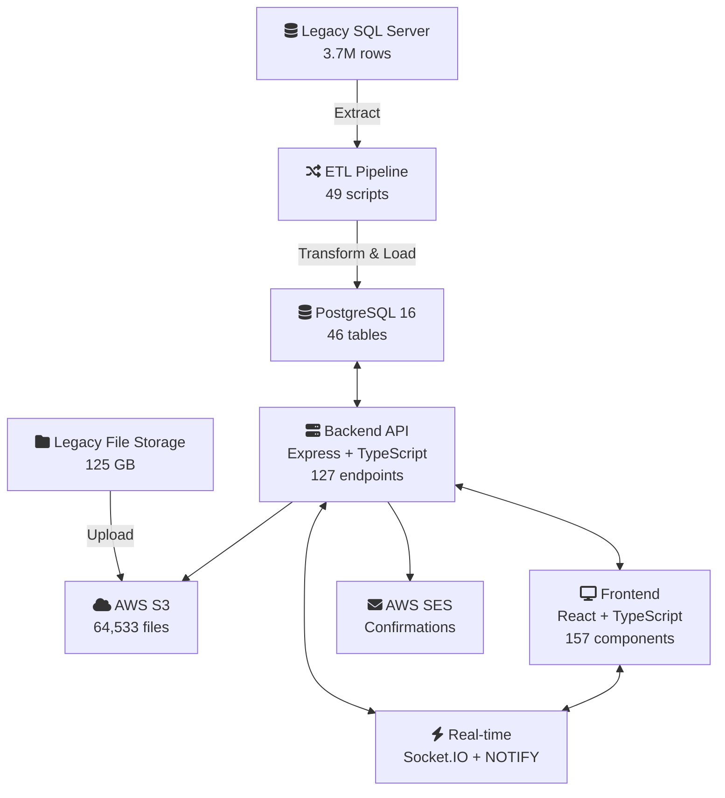

## The Problem

The client's B2B cannabis trading platform -- the Canadian Cannabis Exchange -- was running on aging .NET/SQL Server infrastructure with no migration path and growing platform continuity risk. If the legacy system went offline, years of trading data, compliance records, and business relationships would go with it.

At stake:
- **3.7 million rows** of transaction history, product data, and user accounts
- **125 GB of compliance files** -- COAs, government licenses, trade confirmations
- **1,735 companies** and **4,815 users** on the platform
- **39,748 active product listings**

The engagement had two mandates: preserve every byte of production data, then build a modern replacement from scratch.

## Architecture

Four workstreams ran in parallel -- data preservation, backend API, frontend application, and infrastructure.

## What Was Built

### Trading Platform — Frontend

A 19-page trading application with 157 custom React components, real-time WebSocket state, and role-aware UI across every view.

- **Order Book** — Live buy/sell depth with real-time updates. Orders are matched, locked, and negotiated through a multi-step proposal flow.
- **Trade Book** — Full trade history with counterparty details, filterable by date, strain, grade, and status.
- **Matching Engine UI** — Walks both counterparties through proposal, counteroffer, and confirmation. Lot-level locking prevents double-allocation.
- **Product Listings** — Card grid and hierarchical tree views. Clients submit products through a broker-mediated approval pipeline.
- **Admin Panel** — User/company management, data import, system settings, and audit logs with bulk operations.
- **Alias Mode** — Brokers operate on behalf of any client without re-authentication.
- **Multi-Domain Branding** — Subdomain-based UI switching between admin and client interfaces.
- **Demo Environment** — Full API mocking layer with five demo accounts for stakeholder reviews.
- **E2E Coverage** — 57 Playwright tests across auth, admin, trading, and multi-role workflows.

### Trading Engine — Backend

127 REST endpoints with OpenAPI 3.1.0 validation, deployed on EC2 via Docker with CI/CD auto-rollback.

- **Matching Engine** — Core business logic pairing BUY and SELL orders with lot locking, counteroffers, partial fills, and multi-round negotiation.
- **Deal & Confirmation Pipeline** — Trade execution triggers PDF generation and automated email dispatch to both parties.
- **Multi-tenant RBAC** — Seven role tiers from GUEST to ADMIN, with permissions scoped per company and license type.
- **Real-time Events** — Socket.IO backed by PostgreSQL NOTIFY. Order book changes, trade confirmations, and admin actions push instantly to connected clients.
- **Security Layer** — JWT with rotating refresh tokens, rate limiting, session management via Redis, and brute-force prevention.

### Data Migration

Data preservation was the first workstream -- it started before any platform code was written.

- **3.7M rows** extracted from SQL Server binary backups and transformed through a 12-stage ETL pipeline into PostgreSQL, respecting foreign key dependencies across 43 source tables.
- **119.7 GB of media** (64,533 files) migrated to S3 -- COAs, lab results, licenses, trade confirmations, and product imagery.
- **49 transformation scripts** handling schema mapping, data type conversion, and referential integrity validation across the full legacy-to-modern schema translation.

### Infrastructure

- **CI/CD** — GitHub Actions → EC2 Docker rebuild with health checks and auto-rollback on failure.
- **Daily Backups** — Automated PostgreSQL exports to S3 with encryption and email notification. Sub-10-minute disaster recovery.
- **Containerized Deployment** — Docker Compose managing the API, Redis, and health check services.

Current cloud infrastructure is provisioned for QA and UX testing. Production deployment will receive a revised infrastructure architecture with hardened security, optimized resource allocation, and finalized scaling configuration.

## Technical Highlights

### Legacy Platform Analysis

No documentation existed for the legacy system's business logic. I conducted a thorough platform analysis -- mapping every workflow, data relationship, and edge case across order matching, trade settlement, permissions, and compliance. That analysis produced 13 feature specifications that became the blueprint for the rebuild.

### Cannabis Regulatory Complexity

Every product listing carries Certificates of Analysis, Health Canada license references, and government compliance documents. The RBAC system enforces visibility rules tied to license types -- cultivators, processors, and brokers each see different data based on their regulatory role. Lot-level traceability is maintained from seed to sale.

### AI-Assisted Development

Built across 18+ focused development sessions using specialized AI agent teams working in parallel -- database architects, frontend developers, security auditors, and code reviewers coordinating simultaneously on different subsystems.

## By the Numbers

| Metric | Value |
|--------|-------|
| React components | 157 custom + 36 base |
| API endpoints | 127 (OpenAPI validated) |
| Database tables | 46 |
| Database migrations | 51 |
| E2E tests | 57 (Playwright) |
| Backend test suites | 26 |
| Rows migrated | 3.7M |
| Media migrated | 64,533 files (119.7 GB) |
| ETL scripts | 49 |
| RBAC role tiers | 7 |

---

*The largest project in this portfolio by every measure -- from decompiled legacy binaries to a production-grade trading platform for a regulated commodity market.*
