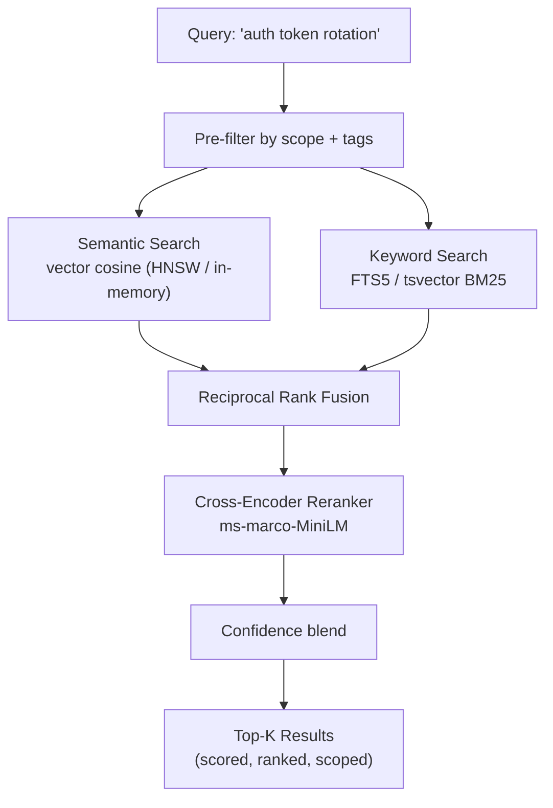
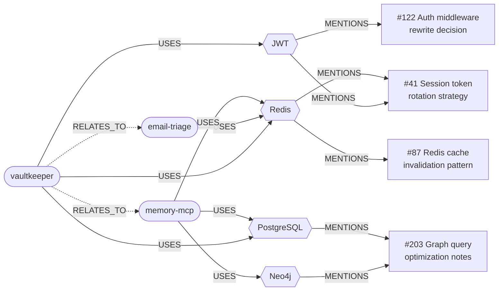
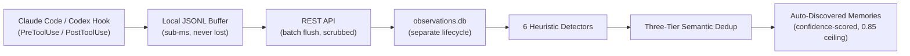
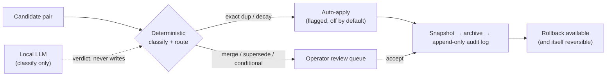

## Version History

> **v1.0:** SQLite backend, embedding search, basic CRUD. A memory that could store and find.
>
> **v1.1:** 5-layer stack (PostgreSQL, Neo4j, Redis, MinIO, ONNX). Graph reasoning, cross-encoder reranking, promotion pipeline. A memory that could *think*.
>
> **v1.2:** Auto-discovery pipeline. Observes tool use, detects behavioral patterns, creates confidence-scored memories autonomously. A memory that *learns*.
>
> **v1.3: The Librarian.** Autonomous nightly consolidation: collapses duplicates, decays stale memories, routes contradictions and supersessions. A memory that *curates itself while it sleeps*.
>
> **v2.0: Safe autonomy.** The deterministic engine owns every write; the optional local LLM only classifies and is locked out of the write path. Every change is snapshot-first, audited, and reversible. A memory you can *trust to edit itself*.

## The Gap

Every major AI assistant (ChatGPT, Claude, Gemini) handles memory the same way: a flat list of facts stapled to every conversation. No search. No relationships. No lifecycle. The entire memory is dumped into the context window every turn, regardless of relevance.

This approach doesn't scale. At a few hundred memories, you're burning half your context on irrelevant facts. There's no way to ask "what connects this project to that decision?" because there are no connections. Just a pile of sticky notes.

The tooling gap is even wider for AI coding assistants. They start every session from zero. Yesterday's architectural decisions, past debugging sessions, operator corrections. All gone. The assistant repeats mistakes it was already corrected on.

But the deepest problem shows up *after* you solve recall. Once a system remembers everything, the memory itself starts to rot: duplicates pile up, stale facts outrank current ones, and contradictions ("we use X" and "we switched to Y") both keep surfacing with no notion of which is true now. Recall was never the hard part. **Curation is.**

## What I Built

A dedicated memory infrastructure layer with two halves: a retrieval stack that finds only what's relevant, and a consolidation engine that keeps the store lean and correct over time, without a human gardening it and without ever shipping the codebase's context to a cloud model.

The retrieval side spans specialized backends, each handling a different type of recall:

| Layer | Technology | Purpose |
|-------|-----------|---------|
| **Structured + Semantic** | SQLite (default) or PostgreSQL + pgvector | Long-term storage with vector similarity search |
| **Graph** | Neo4j (optional) | Entity extraction and relationship traversal: "what's connected to what" |
| **Working Memory** | Redis (optional) | Ephemeral session state, search caching, multi-agent shared context with TTL |
| **Artifact Storage** | MinIO (optional) | S3-compatible object storage for large files linked to memories |
| **Intelligence** | ONNX models (local) | Embedding generation + cross-encoder reranking, fully offline |

The system exposes **19 tools** via the Model Context Protocol, making it plug-and-play for any MCP-compatible AI assistant. Claude Code and Codex CLI share the same store. No custom integration, no vendor lock-in. Every optional backend has an `enabled` flag; the whole thing runs on a single SQLite file if you want it to.

## Retrieval Architecture

The search pipeline is where this diverges most from flat-memory systems. Instead of dumping everything into context, it retrieves only what's relevant:

Three search modes fuse together:
- **Semantic**: the query is embedded into a 384-dimension vector, compared against indexed memory embeddings via cosine distance
- **Keyword**: BM25 ranking against a full-text index (SQLite FTS5 or Postgres `tsvector`)
- **Hybrid** (default): reciprocal rank fusion merges both result sets, a cross-encoder reranker scores the top candidates for precision, and each memory's confidence is blended into the final order, so a well-evidenced memory outranks a lexically-similar guess

Every search is scoped. A query scoped to `project:vaultkeeper` won't bleed into memories from other projects. A separate fast-recall path (used by the per-prompt hook) skips reranking and runs entirely in-process, no network round-trip.

## Graph Reasoning

Vector search answers "what's similar to this?" The graph layer answers "what's connected to this?". A fundamentally different question.

When a memory is stored, an entity extraction pipeline identifies people, projects, technologies, and concepts, then writes them as nodes and edges in Neo4j. Over time, a knowledge graph emerges organically from the memories themselves:

A query like *"How does Redis connect to the VK platform?"* traverses from the `Redis` entity node to find three paths: the session token strategy, the cache invalidation pattern, and a shared dependency with email-triage. Vector search would only find documents *about* Redis. The graph finds documents *connected through* Redis.

- *"What decisions were made about authentication?"* → traverse from `JWT` entity → 2 connected memories across 1 project
- *"What infrastructure do these three projects share?"* → fan-out from project nodes → intersection at `Redis` and `PostgreSQL`
- *"Show me everything connected to the email triage system"* → single entity traversal → technologies, decisions, related projects

This is the kind of reasoning that flat key-value memory fundamentally cannot do.

## Auto-Discovery: Memory That Learns

Everything above is explicit memory: the operator stores it, the system recalls it. An observation layer watches how the AI assistant is actually used and discovers patterns autonomously.

The pipeline has six zero-cost detectors (no API calls, no LLM inference):

- **Repeated tool+input**: same command run 3+ times across sessions → "operator frequently runs `npm test` before committing"
- **Error-then-fix**: failed tool call followed by a successful retry → "when Jest fails with ENOMEM, increase `--maxWorkers`"
- **Hot files**: same file edited 3+ times per session → "`src/config.ts` is a frequent edit target"
- **Repeated commands**: normalized shell commands recurring → "operator uses `docker compose up -d` to start the dev stack"
- **Recurring errors**: the same failure signature across sessions, tiered by recurrence and surfaced proactively on the next prompt
- **Sequences**: A→B tool patterns recurring across sessions → "after editing a route, you always run the integration test"

Detected patterns become memories with a confidence score. The scoring is deliberately conservative:

- **Self-limiting reinforcement**: each repeated observation adds `+0.05 * (1 - current)`, so high-confidence patterns get smaller bumps, preventing echo chambers
- **Confidence ceiling at 0.85**: auto-discovered memories never auto-promote past this. The operator must explicitly confirm for higher trust
- **Durability-scaled decay**: confidence decays if a pattern stops appearing, but a memory seen 20 times decays roughly 4× slower than one seen once, and a recall resets its clock
- **Bounded search influence**: discovered memories can reduce their search score by at most 50%, ensuring they still surface but don't dominate explicit knowledge

Three-tier semantic deduplication prevents near-duplicate creation: similarity ≥ 0.95 reinforces the existing memory, 0.85 to 0.95 reinforces and logs new evidence, below 0.85 creates a new entry.

Security is multi-layered: client-side secret scrubbing before network transit, server-side scrubbing as defense-in-depth, a content denylist blocking dangerous command patterns, and API-key authentication on observation endpoints.

## Dreaming: Memory That Curates Itself

Recall and discovery both *add* to the store. Left alone, any memory system that only grows becomes landfill. The consolidation layer (internally, "the Librarian") is the part that runs while the system is idle and keeps the corpus lean and correct:

- **Duplicate collapse**: exact and near-duplicate memories are merged down to one, preserving the strongest evidence
- **Decay**: memories that stopped being useful are archived (never hard-deleted), on a durability-aware schedule so well-evidenced knowledge sticks around
- **Contradiction routing**: when two memories disagree, the system doesn't pick a winner blindly; it classifies the relationship
- **Supersession as a chain, not a deletion**: "we switched to Y" *supersedes* "we use X": both stay queryable with `deprecated_at` / `valid_from` markers, so history is never lost and the current fact is unambiguous

It runs deterministic-first over a rotating window of the corpus (with a whole-corpus mode for catching far-apart duplicates), fires only during quiet hours when the machine is idle, and is idempotent per window so a crash mid-pass simply retries.

## The Safety Problem and How It's Solved

Here's the part most memory systems get wrong. The hard problem in autonomous memory isn't *curating*. It's curating **safely**. The moment you let a language model rewrite or delete stored facts, a single hallucinated or prompt-injected rationale can quietly corrupt everything the system knows. So most designs take one of two unsatisfying paths: they don't curate at all (append-only, and you become the janitor), or they let the model edit memory freely and hope. MNEMOS takes neither.

Three invariants make autonomy trustworthy:

**The deterministic engine owns every write.** Routing, supersession direction, and every mutation are plain code. The optional local model *only classifies a pair* (duplicate, preference-change, conditional, contested, or unrelated) and is structurally locked out of the write path. It cannot rewrite or delete a memory. Turn it off, or let it fail, and the system degrades to deterministic-only behavior byte-for-byte.

**Every change is snapshot-first and audited.** Each write goes snapshot → archive → append-only audit log, with a compensation step that unrolls the mutation if the audit append fails, so no unaudited change can survive. `rollback` restores a memory's content, embedding, and tags from the snapshot, and is itself reversible.

**Autonomy is gated.** Only two change classes (exact duplicates and decay) can ever auto-apply, and both ship off by default; everything else queues for a one-click operator review. Adversarial "GATE" reviews run the whole pipeline against a *copy* of real data, including a deliberately malicious classifier with every auto-accept flag turned on, to prove there's no path from any verdict to an unreviewed write.

The whole system is fully local: embeddings, reranking, and the optional reasoner all run on-device via ONNX and Ollama. No cloud LLM sits in the retrieval path *or* the consolidation path. Your codebase context never leaves the box.

## Proactive Surfacing

Memory is only useful if it shows up at the right moment. A per-prompt hook injects the relevant memory (plus the right tool, skill, or project convention) into the assistant's context *before* the operator names it, under a tight latency budget that fails open: a slow or absent server surfaces nothing, never a hang.

## Built to Be Watched

Autonomous systems that touch your knowledge shouldn't be black boxes. A live Server-Sent-Events stream and a four-tab web console expose exactly what the system is doing: real-time observation events, operational panels (confidence distribution, decay, dream history, corpus health), and historical session replay, so every discovery and every consolidation is inspectable after the fact.

## Design Principles

**Deterministic autonomy.** Autonomy people can trust isn't "the model decides." It's "the code decides, the model advises, and everything is reversible." The LLM is a classifier, never an author.

**Zero external API dependencies.** Embedding, reranking, and reasoning run locally via ONNX and Ollama. No token costs, no network latency, no third-party data sharing. A memory system that depends on an API to think isn't a memory system; it's a feature that disappears when the API changes.

**Interface-driven architecture.** Every backend implements a shared TypeScript interface (`IMemoryStore`, `IVectorSearch`). PostgreSQL swaps for SQLite; the in-memory vector index swaps for pgvector. Clients don't know or care which backend is active.

**Eval-gated deployment.** A retrieval evaluation harness measures Precision@K, Recall@K, MRR, and NDCG against a seeded query set, and a separate zero-LLM replay harness runs a full consolidation pass over a synthetic gold corpus and asserts it made zero model calls. No changes ship without confirming quality holds. Measurements, not impressions.

**Graceful degradation.** Neo4j, Redis, MinIO, the reasoner, and consolidation each have a flag. The system runs on SQLite alone, or with any combination of optional layers. Every layer is additive.

## Results

The system runs 24/7 as a Windows service, accessible across a WireGuard VPN from any device on the network. It's been the primary memory backend for all AI-assisted development work since deployment.

- **Self-curating**: duplicates collapse, stale facts decay, and contradictions resolve into supersession chains, without manual gardening
- **Safe by construction**: the deterministic engine owns every write; the LLM only classifies; every autonomous change is snapshot-first, audited, and reversible
- **Fully local**: embedding, search, reranking, pattern detection, and reasoning run without internet: 0 external API calls
- **Autonomous learning**: 6 zero-cost detectors observe, detect, and remember without being told
- **19 MCP tools** shared across Claude Code and Codex CLI without configuration
- **593-test regression suite** across both backends, plus a zero-LLM replay harness and adversarial GATE reviews against a copy of real data

---

*v1.0 was a database that could remember. v1.1 was a system that could reason about what it remembers. v1.2 decides what's worth remembering in the first place. v2 curates what it remembers while it sleeps, and can prove, and undo, every change it made.*
