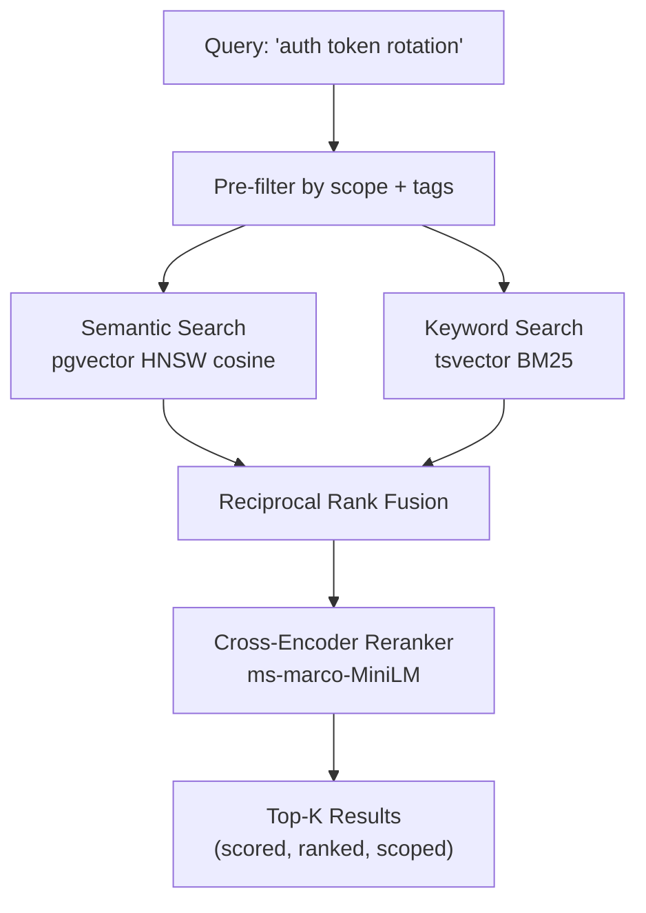

## The Gap

Every major AI assistant (ChatGPT, Claude, Gemini) handles memory the same way: a flat list of facts stapled to every conversation. No search. No relationships. No lifecycle. The entire memory is dumped into the context window every turn, regardless of relevance.

This approach doesn't scale. At a few hundred memories, you're burning half your context on irrelevant facts. There's no way to ask "what connects this project to that decision?" because there are no connections. Just a pile of sticky notes.

The tooling gap is even wider for AI coding assistants. They start every session from zero. Yesterday's architectural decisions, past debugging sessions, operator corrections. All gone. The assistant repeats mistakes it was already corrected on.

## What I Built

A dedicated memory infrastructure layer with five specialized backends, each handling a different type of recall:

| Layer | Technology | Purpose |
|-------|-----------|---------|
| **Structured + Semantic** | PostgreSQL + pgvector | Long-term storage with HNSW vector indexing for sub-linear similarity search |
| **Graph** | Neo4j | Entity extraction and relationship traversal: "what's connected to what" |
| **Working Memory** | Redis | Ephemeral session state, search caching, multi-agent shared context with TTL |
| **Artifact Storage** | MinIO | S3-compatible object storage for large files linked to memories |
| **Intelligence** | ONNX models (local) | Embedding generation + cross-encoder reranking, fully offline |

The system exposes 12 tools via the Model Context Protocol, making it plug-and-play for any MCP-compatible AI assistant. No custom integration, no vendor lock-in.

## Retrieval Architecture

The search pipeline is where this diverges most from flat-memory systems. Instead of dumping everything into context, it retrieves only what's relevant:

Three search modes fuse together:
- **Semantic**:query is embedded into a 384-dimension vector, compared against HNSW-indexed memory embeddings via cosine distance
- **Keyword**:BM25 ranking against PostgreSQL's `tsvector` full-text index
- **Hybrid** (default): reciprocal rank fusion merges both result sets, then a cross-encoder reranker scores the top candidates for precision

Every search is scoped. A query scoped to `project:vaultkeeper` won't bleed into memories from other projects.

## Graph Reasoning

Vector search answers "what's similar to this?" The graph layer answers "what's connected to this?". A fundamentally different question.

When a memory is stored, an entity extraction pipeline identifies people, projects, technologies, and concepts, then writes them as nodes and edges in Neo4j. Over time, a knowledge graph emerges organically from the memories themselves:

A query like *"How does Redis connect to the VK platform?"* traverses from the `Redis` entity node to find three paths: the session token strategy, the cache invalidation pattern, and a shared dependency with email-triage. Vector search would only find documents *about* Redis. The graph finds documents *connected through* Redis.

- *"What decisions were made about authentication?"* → traverse from `JWT` entity → 2 connected memories across 1 project
- *"What infrastructure do these three projects share?"* → fan-out from project nodes → intersection at `Redis` and `PostgreSQL`
- *"Show me everything connected to the email triage system"* → single entity traversal → technologies, decisions, related projects

This is the kind of reasoning that flat key-value memory fundamentally cannot do.

## Memory Lifecycle

Memories aren't static. An automated promotion pipeline manages the lifecycle:

- **Decay**:relevance score drops exponentially based on access recency (30-day half-life), with type-weighted adjustments. Frequently accessed memories stay hot
- **Pinning**:critical memories (operator identity, foundational corrections) are marked permanent and exempt from decay
- **Consolidation**:near-duplicate memories (>0.95 cosine similarity) are detected and flagged for merge or auto-archive
- **Auto-archive**:memories below the relevance threshold are soft-archived, never hard-deleted

The pipeline is driven by a scoring function that considers recency, access frequency, memory type, and content quality, then runs as a scheduled background process.

## Design Principles

**Zero external API dependencies.** Embedding generation (all-MiniLM-L6-v2) and reranking (ms-marco-MiniLM) run locally via ONNX. No token costs, no network latency, no third-party data sharing. A memory system that depends on an API to think isn't a memory system. It's a feature that disappears when the API changes.

**Interface-driven architecture.** Every backend implements a shared TypeScript interface (`IMemoryStore`, `IVectorSearch`). PostgreSQL can be swapped for SQLite. The in-memory embedding index can be swapped for pgvector. Clients don't know or care which backend is active.

**Eval-gated deployment.** A built-in retrieval evaluation harness measures Precision@K, Recall@K, MRR, and NDCG against a seeded query set. No changes ship without confirming search quality holds. This is how production search systems are maintained: not vibes, measurements.

**Graceful degradation.** Neo4j, Redis, and MinIO each have an `enabled` flag. The system runs on PostgreSQL alone, or SQLite alone, or with any combination of optional backends. Every layer is additive.

## Results

The system runs 24/7 as a Windows service, accessible across a WireGuard VPN from any device on the network. It's been the primary memory backend for all AI-assisted development work since deployment.

- **Sub-50ms hybrid search** with cross-encoder reranking, faster than a filesystem glob
- **12 MCP tools** available to any compatible AI assistant without configuration
- **Full offline operation**:embedding, search, and reranking run without internet
- **Automated lifecycle**:the memory store stays relevant without manual curation
- **44-test regression suite**:every phase validated against the eval harness baseline

---

*Current AI memory is where databases were before indexing: brute-force scans over flat files. This project is the index.*
