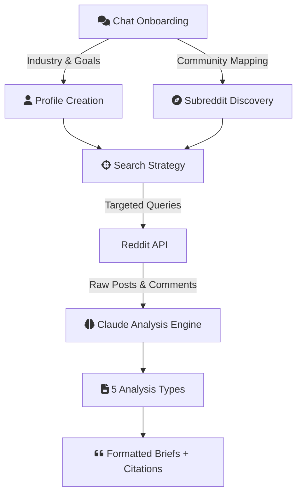

# Reddit Intelligence Platform

*AI-Powered Market Research Tool*

## Overview

A purpose-built research tool that turns Reddit into structured market intelligence. Rather than requiring users to know which subreddits to monitor or what queries to run, a conversational onboarding experience builds a detailed user profile and maps relevant communities — then the system generates targeted research across five analysis types with full source citations.

## The Problem

Reddit is one of the richest sources of unfiltered market intelligence, but extracting value from it is hard:

- **Signal-to-noise ratio** is terrible without domain expertise
- **Manual monitoring** doesn't scale across communities
- **Traditional market research** costs $10K+ per report
- **Existing tools** require technical users who already know which subreddits to track

## Solution: Chat-First Research

The tool flips the typical approach. Instead of asking users to configure scrapers and pick subreddits, an AI conversation guides the entire setup — building both a user profile and a subreddit map before any research begins.

### Conversational Onboarding

The onboarding process does two equally important things:

**1. Profile Creation**
The AI builds a detailed understanding of who the user is and what they need:
- Industry vertical and niche positioning
- Target audience and customer segments
- Specific intelligence goals (competitive, content, opportunity)
- How they'll use the output (content creation, consulting, strategy)

**2. Subreddit Discovery**
Using the profile context, the AI discovers and ranks relevant communities:
- Maps subreddits by relevance score to the user's industry
- Identifies adjacent communities that surface non-obvious insights
- Explains why each subreddit was selected
- Configures monitoring scope automatically

The profile and subreddit map together form the research foundation — every subsequent analysis is shaped by both.

### AI-Powered Search Strategy

Rather than scraping entire subreddits, the system generates focused search queries from the user's profile context — reducing noise by 83% and keeping analysis costs under $1 per report.

### Five Analysis Types

**Comprehensive** — Full market overview surfacing dominant themes, recurring patterns, and key takeaways across all mapped communities.

**Pain Points** — Top challenges and frustrations ranked by frequency and confidence scoring, drawn from real user conversations.

**Opportunities** — Service and product opportunities matched directly to the user's profile, with evidence from community discussions.

**Dual Perspective** — Separate analysis for multiple stakeholders (e.g. buyers vs. sellers, practitioners vs. decision-makers).

**Trends** — Emerging patterns and shifts in sentiment backed by evidence trails with timestamps.

### Profile Modes

Users select how they'll use the intelligence, and the output adapts:

- **Content Creator** — blog ideas, LinkedIn posts, newsletter topics backed by Reddit evidence
- **Consultant** — service opportunities, pitch angles, engagement strategies with supporting data

Each mode tailors the output format, tone, and recommendations to match the use case.

### Evidence-Based Citations

Every insight links back to its source — Reddit posts with upvote counts, timestamps, and direct URLs. No black-box analysis.

## Architecture

### Tech Stack
- **Frontend**: Next.js with React Query
- **Backend**: FastAPI with SQLAlchemy (async)
- **Database**: PostgreSQL via Supabase
- **Cache**: Redis for session and scrape data
- **Auth**: JWT with bcrypt
- **Payments**: Stripe subscription billing
- **AI**: Claude API for analysis and onboarding

## Current State

Core infrastructure is deployed and the analysis engine is production-tested:
- Full-stack deployed (Vercel + Railway + Supabase)
- User registration, auth, and session management working
- Database schema (12 tables) with seed data
- Analysis engine validated across multiple verticals
- Payment integration in progress

## What's Next

- Complete Stripe subscription flow
- Finalize the chat onboarding UI
- Scheduled monitoring with email delivery
- Historical trend comparison (week-over-week)

---

*This project demonstrates conversational AI product design, full-stack development with Python and Next.js, and building research tools that abstract complexity behind intuitive interfaces.*
