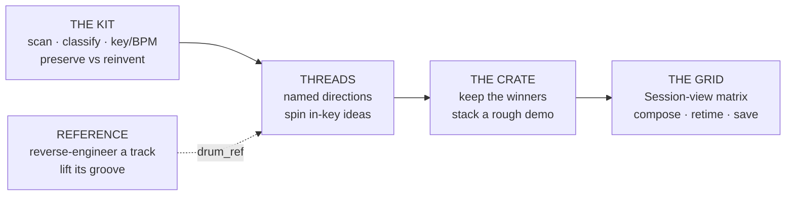

## The Gap

A remix kit arrives as *a folder of files*: a dozen stems, maybe some MIDI, a reference track the producer is chasing. Every DAW treats it the same way: an empty session and a blinking cursor. Which stems carry the song? Which are generic and worth rebuilding? What key and tempo are you actually working in? What chord moves keep it in the pocket? The information is all *in* the files; nothing surfaces it.

The usual answer is hours of manual triage (soloing stems, guessing keys, naming things) before a single creative decision gets made. The blank-set tax. I wanted a tool that reads the folder and hands back **decisions, not just data**: here are the likely roles, here's what to preserve vs. reinvent, here are bass/chords/arp/drums already in your key, here's how the reference is arranged. Deterministic and rule-based first; AI only after the rules.

## What I Built

reDonk is a Windows-first, Python-first toolkit with two faces over one engine: a scriptable **CLI** and a creative **studio GUI**. The core is a pipeline (*validate → scan → classify → analyze → report*) that degrades gracefully at every tier, so the base install does useful work with zero heavy dependencies and richer analysis unlocks as you opt into extras.



Every stage writes its own files and never touches the source kit. **Non-destructive is the one invariant.** Output lands under a disposable `redonk-output/`; the input folder is read-only, always.

## Deterministic by Design

Generation is rule-based, not a model rolling dice. A keyword-matched `VibePreset` holds fixed 16-step patterns and two diatonic progressions (minor + major, picked by the detected mode); bass, chords, and arp all share that progression so they stay in key. The same seed produces byte-identical MIDI. A separate `--variation 0..1` knob layers *structural* mutation (arp rotations, dropped notes, chord syncopation) through its own per-part RNG, so `variation=0` is provably unchanged and `(seed, variation)` is reproducible.

The result is the opposite of a black box: every idea is explainable, repeatable, and version-controllable. Music theory lives in one dependency-free module (scales, diatonic triads, functional substitution families, reharmonization) that's unit-tested with plain numbers: no audio, no librosa, no GPU.

## Tiered, Graceful Dependencies

The whole stack is built so a missing tool degrades to a note, never a crash:

| Tier | Needs | Unlocks |
|------|-------|---------|
| **Base** | stdlib only | filename scan, role classification, MIDI analysis, preserve/destroy, generation |
| **Loudness** | ffmpeg | LUFS / RMS, normalized previews, tempo-aware loop slices |
| **Deep** | librosa (`dsp` extra) | BPM, key, onset density, loop candidates, groove extraction |
| **Transcribe** | Basic Pitch (ONNX) | audio → MIDI for pitched stems with no sibling MIDI |
| **Separate** | audio-separator (torch) | split a mix/reference into stems for groove transfer |
| **AI** | Anthropic / audiocraft | a prose remix brief; a vibe → audio sketch that becomes a reference |

MIDI→audio preview mirrors the same ladder: fluidsynth + soundfont for real instruments, falling back to a pure-stdlib oscillator (sine/saw/square + ADSR, synthesized drums) so a preview **always** renders.

## Groove & Reference Reverse-Engineering

Producers work from references: "I want *this* hi-hat pattern." reDonk's `reverse` command reads a finished track's BPM, key, an energy curve, and a hybrid arrangement map (librosa supplies structural boundaries; a pure-Python energy heuristic labels intro/build/drop/breakdown/outro), then emits "make my remix feel like this" notes including a structural-inversion idea: open on the peak instead of building to it.

Groove transfer is the DSP centerpiece. Naive per-band onset detection fails because a transient is broadband: every band fires on every hit. The fix: detect onsets **once** on the full signal, then assign each to the band with maximum energy in a 40 ms window. That cleanly lifts kick / snare / hat 16-step grids from a separated drums stem and overrides the preset's drums during generation.

## The Studio: a React Front-End on a Zero-Dependency Backend

The GUI is where the architecture gets opinionated. The backend is a single **Python stdlib `http.server`** (no framework, no build step, no dependencies) that *never imports the engine*. It shells out to the CLI in scripting mode (tab-separated `kind⇥path` lines) and reads `redonk-output/` folders. That boundary is the whole design: the GUI can't drift from the CLI because it only ever drives the CLI.

The front-end is a Next.js 16 / React 19 studio modeled on an Ableton Session view: **THE KIT → THREADS → THE CRATE → THE GRID**, plus a REFERENCE tool. Wiring it to the real backend meant solving an impedance mismatch: the UI's model (named *threads*, *keepers*, grid *composites*) is richer than the folder/concept reality the backend persists.

```mermaid
graph TD
    UI["React studio<br/>TanStack Query"] -->|/api/* (relative)| RW["Next dev rewrite<br/>or static export"]
    RW --> SRV["stdlib http.server<br/>(zero deps)"]
    SRV -->|shell-out -q| CLI["python -m redonk"]
    SRV -->|read / write JSON| OUT[("redonk-output/<br/>analysis · concepts · threads.json · crate.json")]
    CLI --> OUT
```

Three pieces made it clean:

- **An adapter + query layer.** A thin typed client and a single `adapters.ts` are the *only* place backend shapes become UI types, and the only place fields with no backend source get sensible defaults. TanStack Query handles job polling (async scans/generations resolve inside the mutation, then invalidate), background revalidation for multi-device VPN use, and one shared cache across every view.
- **Server-side association.** Threads and the crate are new per-project JSON files the backend gained (still boundary-pure). When you generate inside a thread, the server parses the job's output, derives each concept's tag from its run-stamp, and files it under that thread, race-free, surviving a mid-job reload.
- **Retime-on-drop.** Dropping a lane from a different-tempo direction into the grid conforms it to the project BPM, pitch-preserved and cached, via a one-line CLI verb the server calls synchronously.

Verified end-to-end in a real browser: create a project, drop stems, scan to real roles and verdicts, spin a thread into auditionable in-key audio, keep the winners, compose them in the grid, and read a full reverse-analysis of a reference, all persisting to disk and surviving reload.

## Results

- **Zero-dependency studio backend:** a Python stdlib server with no build step, no framework, and a hard "never import the engine" boundary that keeps the GUI and CLI permanently in sync
- **Deterministic core:** same seed, same bytes; every generated idea is explainable and reproducible, with AI strictly an opt-in layer in its own files
- **Graceful at every tier:** works on the stdlib alone and unlocks DSP / transcription / separation / AI as extras, degrading to a note instead of failing
- **Non-destructive by construction:** the source kit is read-only; all output is disposable
- **141 tests, ruff-clean**, with the pure music-theory and DSP helpers tested without the heavy dependencies

---

*Most "AI music" tools start with the model and bolt on control. reDonk starts with the producer's decisions (what to keep, what key, what move), makes those deterministic and inspectable, and treats the model as the last layer, not the first.*
